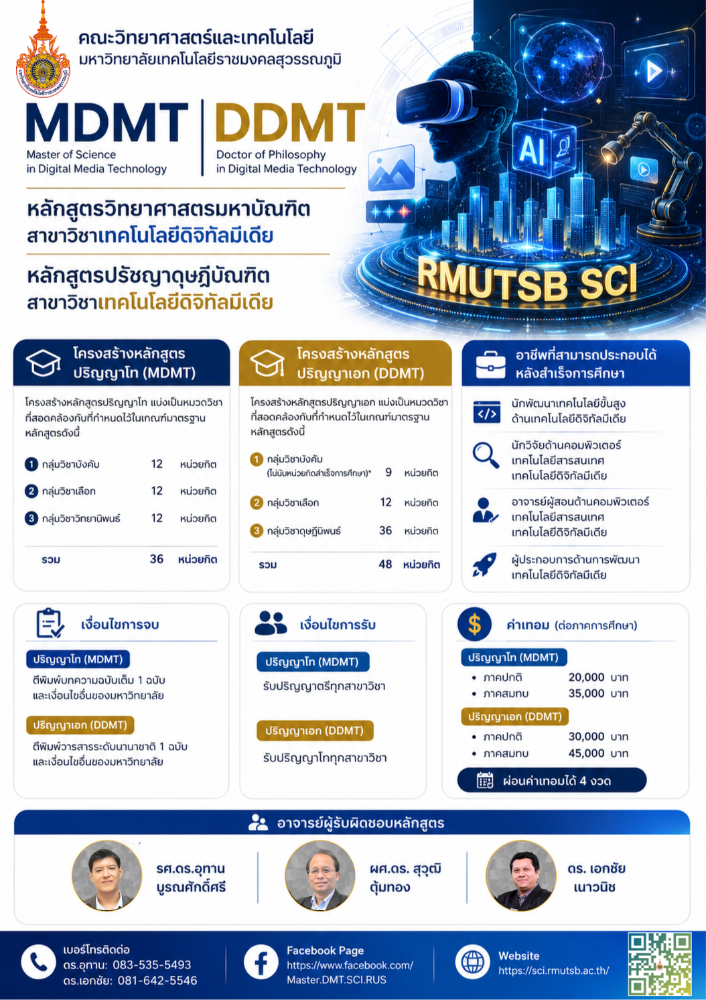

# review-skill

## 🇹🇭 ทักษะ AI สำหรับตรวจสอบโค้ดและจัดการ Issue

**review-skill** คือชุดทักษะ (Skills) สำหรับ AI Coding Agent เช่น Claude Code ที่ช่วยให้การพัฒนาซอฟต์แวร์มีประสิทธิภาพและลดข้อผิดพลาดได้อย่างเป็นระบบ

### หลักสูตรการใช้งาน



### ทักษะที่ได้เรียนรู้

| ทักษะ | รายละเอียด |
|-------|-----------|
| **find-mismatch** | ตรวจหาบั๊กแบบเป็นระบบ — ค้นหาข้อผิดพลาดข้าม boundary, ช่องโหว่ serialization, logic bug, async bug และ stub code |
| **work-on-issues** | ดึง issue จาก GitHub/GitLab เลือกทำงาน สร้าง branch และ PR โดยอัตโนมัติ |

### คุณสมบัติเด่น

- **ตรวจหาบั๊กอัตโนมัติ** — วิเคราะห์โค้ดทั้งโปรเจกต์ ค้นหาข้อผิดพลาดที่ซ่อนอยู่ เช่น ชนิดข้อมูลไม่ตรงกัน, ตัวแปรซ้ำซ้อน, race condition
- **จัดการ Issue เป็นระบบ** — เชื่อมต่อกับ GitHub หรือ GitLab สร้าง branch, commit, PR และปิด issue ได้ทั้งหมด
- **รองรับหลายภาษา** — มีการตรวจสอบเฉพาะสำหรับแต่ละภาษาโปรแกรม
- **ใช้งานง่าย** — ติดตั้งด้วยคำสั่งเดียว พร้อมใช้งานทันที

### เหมาะสำหรับ

- นักพัฒนาที่ต้องการเพิ่มคุณภาพโค้ดด้วย AI
- ทีมที่ใช้ GitHub/GitLab ในการจัดการงาน
- ผู้ที่สนใจใช้ AI Agent ช่วยลดภาระงานซ้ำๆ

---

## 🇬🇧 English

A code review skill and issue workflow skill for AI coding agents.

## Install

```bash
npx skills@latest add utarn/review-skill
```

## Skills

| Skill | Description |
|-------|-------------|
| [find-mismatch](skills/find-mismatch/SKILL.md) | Systematic bug detection — finds cross-boundary mismatches, serialization gaps, logic bugs, async bugs, and stub code |
| [work-on-issues](skills/work-on-issues/SKILL.md) | Fetch issues from GitHub or GitLab, implement them, and close completed tickets |

## find-mismatch

`/find-mismatch` performs systematic bug detection across your entire codebase:

- **Cross-boundary contract mismatches** — function names, parameter names/types, return types
- **Serialization gaps** — casing mismatches, optional vs required fields, encoding layers
- **Logic bugs** — double counting, off-by-one, dead code, shadowed variables
- **Property & method access errors** — null dereferences, wrong types, optional chaining
- **Async & concurrency bugs** — missing awaits, race conditions, resource leaks
- **Placeholder & stub code** — unused results, TODOs, dead imports
- **Language-specific checks** — type system gaps per language

### Usage

In your AI agent (Claude Code, etc.):

```
/find-mismatch
```

Then specify files or directories to review, or let it scan the whole project.

## work-on-issues

`/work-on-issues` fetches open issues from GitHub or GitLab, lets you pick which to work on, implements the work, and closes completed tickets.

### Usage

In your AI agent:

```
/work-on-issues
```

It will:
1. Detect the tracker (GitHub via `gh` or GitLab via `glab`) from your remotes
2. List open issues for you to pick from
3. Label, branch, implement, commit, and create a PR/MR
4. Comment on the issue and close it when merged

## Skill format

This repo is compatible with [skills.sh](https://github.com/mattpocock/skills).

```
review-skill/
├── .claude-plugin/
│   └── plugin.json
├── skills/
│   ├── find-mismatch/
│   │   └── SKILL.md              # Systematic code review instructions
│   └── work-on-issues/
│       └── SKILL.md              # Issue workflow instructions
└── README.md
```

## License

MIT
