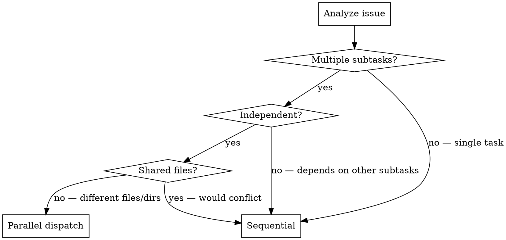

# Work on Issues

Fetch issues from the configured tracker (GitHub or GitLab), pick up work, implement it, and close completed issues. Each issue is handled by a dedicated sub agent so every agent starts with a clear, focused context. Within each issue, independent subtasks are parallelized across multiple sub agents. Every sub agent automatically runs [find-mismatch](../find-mismatch/SKILL.md) after implementation — bugs are fixed immediately without prompting for confirmation.

## Detecting the Tracker

Determine the tracker at session start by checking remotes:

```bash
git remote -v
```

| Remote host | Tracker | CLI | Command prefix |
|-------------|---------|-----|----------------|
| `github.com` | GitHub Issues | `gh` | `gh issue ...` |
| `gitlab.com` | GitLab Issues | `glab` | `glab issue ...` |

Store the resolved CLI alias (`gh` or `glab`) as **`$TRACKER`** for the rest of this skill. All commands below use `$TRACKER`.

### GitLab terminology note

GitLab uses different nouns than GitHub:
- **issues** → same concept, CLI is `glab issue`
- **merge requests (MRs)** = GitHub's **pull requests (PRs)** → `glab mr` instead of `gh pr`
- **notes** = GitHub's **comments** → `glab issue note` / `glab mr note` instead of `gh issue comment` / `gh pr comment`

When commands are structurally identical, use `$TRACKER` as a shortcut. When the subcommand differs (`note` vs `comment`, `mr` vs `pr`), use the platform-specific form.

## Workflow

### Phase 1: Fetch & Triage

1. **List open issues** — fetch in machine-readable format:

   ```bash
   # GitHub — use --json for machine-readable output (NOT -F json, that flag does not exist in gh)
   gh issue list --repo <repo> --state open --json number,title,labels
   # GitLab — lists open issues by default, no --state flag
   glab issue list -F json
   ```

   For GitLab with label filtering:
   ```bash
   glab issue list --label "bug" -F json
   ```

2. **Parse & present** — summarize each issue: number, title, labels, brief description. Present the list to the user.

3. **Let the user pick** — present the issue list with these options:
   - Pick a specific issue number to work on
   - Pick an issue and say **"from here onwards"** / **"this and all remaining"** to work iteratively through that issue and every open issue after it, stopping only when no issues remain or the user interrupts
   - Suggest based on labels/priority if the user is unsure

   When "onwards" mode is selected, the orchestrator loops: dispatch sub agent for the chosen issue → complete Phase 2–3 → automatically move to the next open issue → repeat until the list is exhausted. The user can pause or stop between issues.

4. **Check issue state** — before reading the full issue, verify it's still open. If it's already closed, skip it and move to the next one. No point implementing a resolved issue.

   ```bash
   # GitHub
   gh issue view <number> --repo <repo> --json state
   # GitLab
   glab issue view <number> -F json --jq '.state'
   ```

   If state is `closed` / `CLOSED`, skip to next issue.

5. **Read the full issue** — load details and comments:

   ```bash
   # GitHub
   gh issue view <number> --repo <repo> --comments
   # GitLab
   glab issue view <number> --comments
   ```

   For machine-readable output: GitHub uses `--json <fields>`, GitLab uses `-F json`.

6. **Assign / label** — mark the issue as in-progress if the tracker supports it:

   ```bash
   # GitHub
   gh issue edit <number> --repo <repo> --add-label "in-progress" --remove-label "needs-triage"
   # GitLab
   glab issue update <number> --label "in-progress" --unlabel "needs-triage"
   ```

### Phase 2: Implement (Sub Agent Per Issue)

**Every issue gets its own sub agent.** This gives each agent a clean, focused context — no pollution from previous issues, no accumulated baggage. The orchestrator (you) coordinates; the sub agent executes.

7. **Create a branch** — use the issue number in the branch name:

   ```bash
   git checkout -b work-on-issue-<number>
   ```

8. **Dispatch a sub agent** to implement the issue. Construct the prompt with everything the agent needs:

   ```markdown
   You are implementing issue #<number>: <title>.

   ## Issue Description
   <paste full issue body and acceptance criteria>

   ## Branch
   work-on-issue-<number> (already checked out)

   ## Constraints
   - Follow the issue description and acceptance criteria exactly
   - Do NOT modify files unrelated to this issue
   - Run tests, lint, and build after implementation
   - Commit with message: "fix: resolve #<number> — <short description>"

   ## Subtask Parallelization
   Before implementing, analyze whether the issue contains independent subtasks that can run in parallel (see Subtask Parallelization section below). If so, dispatch parallel sub agents for non-blocking subtasks.

   ## Post-Implementation: Find-Mismatch Review (Automatic)
   After implementation is complete and tests pass, you MUST run a find-mismatch review on all files you modified or created:

   1. **Run the find-mismatch skill** — invoke it via the Skill tool with skill name "find-mismatch"
   2. **Scope the review** — review only the files you changed (the diff). Do NOT review the entire codebase.
   3. **Automatically accept and fix** — for every real bug found:
      - Apply the fix immediately without asking for confirmation
      - Do NOT report bugs without fixing them — fix first, report fixes in your output
      - If a finding is uncertain or a false positive, skip it (only fix confirmed bugs)
   4. **Re-run tests** — after applying all fixes, re-run the test suite to confirm nothing broke
   5. **Proceed** — do not stop or wait for approval; continue to commit

   This step is mandatory and automatic. Do not skip it, do not ask whether to proceed, and do not present findings without also fixing them.

   ## Output
   Return a summary of: what you implemented, what find-mismatch fixes were applied, what tests you ran, and the commit hash.
   ```

   Use the `Agent` tool with `subagent_type: "full-stack-engineer"` for implementation work. The sub agent starts fresh — no context from other issues or prior conversations. The sub agent prompt includes instructions to automatically run find-mismatch after implementation and fix any bugs found.

   **Red Flags — do NOT do these yourself instead of dispatching:**
   - "This issue is too small for a sub agent" → Small issues benefit even more from clean context
   - "I already understand the codebase" → Understanding ≠ best implementation; fresh eyes catch things
   - "Dispatching is overhead" — The sub agent's clean context prevents cross-issue mistakes

9. **Verify** — after the sub agent returns, run verification yourself. Use [verification-before-completion](../verification-before-completion/SKILL.md) if available. Do NOT trust the sub agent's "all tests pass" claim — run the commands and confirm output. The sub agent's find-mismatch fixes are included in its commit; verify the diff looks correct.

10. **Commit** — the sub agent should commit. If it didn't, commit with:

   ```bash
   git commit -m "fix: resolve #<number> — <description>"
   ```

### Phase 3: Submit & Close

11. **Create a PR/MR**:

    ```bash
    # GitHub
    gh pr create --repo <repo> --title "Fix #<number>: <title>" --body "Closes #<number>"
    # GitLab
    glab mr create --title "Fix #<number>: <title>" --description "Closes #<number>"
    ```

12. **Auto-merge the PR/MR** — merge immediately after creation:

    ```bash
    # GitHub
    gh pr merge <number> --repo <repo> --squash --delete-branch
    # GitLab
    glab mr merge <number> --squash --remove-source-branch
    ```

13. **Post a summary comment** on the issue:

    ```bash
    # GitHub
    gh issue comment <number> --repo <repo> --body "Implementation complete. PR: <url>"
    # GitLab
    glab issue note <number> --message "Implementation complete. MR: <url>"
    ```

14. **Update labels and close the issue**. GitHub PRs with "Closes #<number>" in the body auto-close on merge, but do not rely on that — always explicitly close:

    Remove `needs-triage`, `in-progress`, and `ready-for-agent` labels, add `ai-agent-closed`, then close:

    ```bash
    # GitHub — explicitly close the issue (do NOT rely on PR auto-close)
    gh issue edit <number> --repo <repo> --remove-label "needs-triage,in-progress,ready-for-agent" --add-label "ai-agent-closed"
    gh issue close <number> --repo <repo> --comment "Resolved in PR <number>"

    # GitLab — remove old labels, add new label, then close
    glab issue update <number> --unlabel "needs-triage,in-progress,ready-for-agent"
    glab issue update <number> --label "ai-agent-closed"
    glab issue note <number> --message "Resolved in MR <number>"
    glab issue close <number>
    ```

15. **Clean up branch**:

    ```bash
    git branch -d work-on-issue-<number>
    ```

## Subtask Parallelization Within an Issue

Before implementing, the sub agent (or orchestrator) should analyze the issue for independent subtasks.

### When to Parallelize



**Parallelize when:**
- Issue touches multiple files or directories that don't depend on each other
- Subtask A's output is not required as input for subtask B
- Example: "Add validation to form AND update API error messages" — these are independent

**Keep sequential when:**
- Subtasks share the same files (agents would conflict)
- One subtask's output feeds into the next (e.g., write model, then write migration)
- Order matters (e.g., refactor first, then add feature on top)

### How to Dispatch Parallel Subtasks

When the sub agent identifies parallelizable subtasks, it dispatches child agents:

1. **Decompose** — break the issue into subtasks with clear boundaries:

   ```markdown
   Issue #42: "Add user profile page and email notifications"

   Subtask A: User profile page (files: src/pages/Profile.tsx, src/api/profile.ts)
   Subtask B: Email notifications (files: src/services/email.ts, src/templates/)
   → Independent, no shared files → PARALLEL
   ```

2. **Dispatch** — use the Agent tool with `subagent_type: "full-stack-engineer"` for each subtask in a **single message** (parallel dispatch):

   ```
   Agent A: "Implement the user profile page for issue #42..."
   Agent B: "Implement email notifications for issue #42..."
   ```

3. **Constrain each sub agent** — specify exact file/directory boundaries to prevent conflicts:

   ```markdown
   ## Your Scope
   Files you MAY modify: src/services/email.ts, src/templates/
   Files you MUST NOT modify: src/pages/, src/api/profile.ts (another agent is working on these)

   ## Deliverable
   Implement [specific subtask]. Run relevant tests. Return summary of changes.
   ```

4. **Integrate** — after all parallel sub agents return, verify no conflicts and run the full test suite.

### Subtask Prompt Template

```markdown
You are implementing a subtask of issue #<number>: <title>.

## Subtask: <specific subtask description>

## Scope
- Files you MAY modify: <list>
- Files you MUST NOT modify: <list> (another agent is handling these)

## Requirements
<paste relevant acceptance criteria for this subtask only>

## Post-Implementation: Find-Mismatch Review (Automatic)
After your implementation is complete, you MUST run a find-mismatch review on the files you modified:

1. **Run the find-mismatch skill** — invoke it via the Skill tool with skill name "find-mismatch"
2. **Scope the review** — review only the files within your scope that you changed
3. **Automatically accept and fix** — fix every confirmed bug immediately without asking for confirmation
4. **Re-run tests** — confirm fixes don't break anything
5. **Proceed** — do not stop or wait for approval

## Verification
Run tests relevant to your subtask. Return:
1. What you implemented
2. Find-mismatch fixes applied (if any)
3. Files modified
4. Test results
```

## Batch Mode

When the user wants to work through multiple issues:

1. Fetch the full open list (Phase 1).
2. **Dispatch one sub agent per issue** (Phase 2). Issues are dependent — run them one at a time, sequentially. Each issue must complete and merge before the next starts, since later issues may depend on changes from earlier ones. However, once the sub agent breaks the issue into a todo list, independent todo items within that issue CAN be parallelized.
3. Between issues, check with the user before proceeding to the next batch.
4. Maintain a summary table:

   | Issue | Title | Agent | Status | PR/MR |
   |-------|-------|-------|--------|-------|
   | #12 | Fix login bug | Agent-1 | ✅ Closed | !34 |
   | #15 | Add export | Agent-2 | 🔄 In Progress | !36 |
   | #18 | Update docs | Agent-3 | ⏳ Pending | — |

### Iterative Onwards Mode

When the user picks "issue X onwards", the orchestrator enters a sequential iterative loop — one issue at a time:

```
Fetch open issues → Pick starting issue → Loop:
  1. Check if issue is still open — if closed, skip it and move to next
  2. Dispatch sub agent for current issue (Phase 2)
  3. Sub agent breaks issue into todo items; parallelizes independent items
  4. Complete submit & close (Phase 3)
  5. Re-fetch open issues to get updated list
  6. If more issues remain → brief user on next issue, proceed
  7. If no issues remain → stop
```

**Loop behavior:**
- **Skip closed issues** — before dispatching a sub agent, check the issue state. If it's already closed, skip it immediately and move to the next one. No sub agent needed.
- Only one issue is active at a time — wait for it to fully complete before starting the next
- Between each issue, give the user a one-line status update and a chance to pause/stop
- If the user says "stop" or "skip" at any point, break out of the loop
- Re-fetch the issue list after each completion — new issues may have been filed, others closed
- Continue until the list is exhausted or the user interrupts

### Sequential Issue Execution

Issues are always processed one at a time. The sub agent for issue N must finish and merge before issue N+1 starts. Later issues often depend on code or schema changes introduced by earlier ones.

**Parallelism happens at the todo-item level within a single issue**, not across issues. See the Subtask Parallelization section for how to identify and dispatch parallel todo items.

## Label Conventions

| Label | Meaning | Default Color |
|-------|---------|---------------|
| `in-progress` | Currently being worked on | `#E4E669` |
| `ready-for-review` | Implementation done, awaiting merge | `#0E8A16` |
| `blocked` | Cannot proceed (needs info, dependency, etc.) | `#D93F0B` |
| `ai-agent-closed` | Issue closed by AI agent | `#5319E7` |

Apply/remove as the issue moves through states.

### Auto-create labels

If a label does not exist, create it before applying:

```bash
# GitHub
gh label create "in-progress" --repo <repo> --color "#E4E669" --description "Currently being worked on"
# GitLab
glab label create --name "in-progress" --color "#E4E669" --description "Currently being worked on"
```

Use the same pattern for `ready-for-review` (`#0E8A16`), `blocked` (`#D93F0B`), and `ai-agent-closed` (`#5319E7`).

**Shortcut:** wrap label application in a helper — try to apply, and if the CLI reports "not found", create it first then retry:

```bash
# GitHub helper pattern
gh issue edit <number> --repo <repo> --add-label "in-progress" || \
  (gh label create "in-progress" --repo <repo> --color "#E4E669" --description "Currently being worked on" && \
   gh issue edit <number> --repo <repo> --add-label "in-progress")

# GitLab helper pattern
glab issue update <number> --label "in-progress" || \
  (glab label create --name "in-progress" --color "#E4E669" --description "Currently being worked on" && \
   glab issue update <number> --label "in-progress")
```

## Edge Cases

- **No tracker CLI installed** — fall back to API calls or ask the user to install `gh`/`glab`.
- **Multiple remotes** — let the user specify which tracker to use.
- **Issue already assigned** — skip the assignment step.
- **Issue needs clarification** — comment/note on the issue asking for details, then pause implementation.
- **Partially done** — if an issue is too large, break it into sub-issues or a checklist and track progress in a comment/note.
