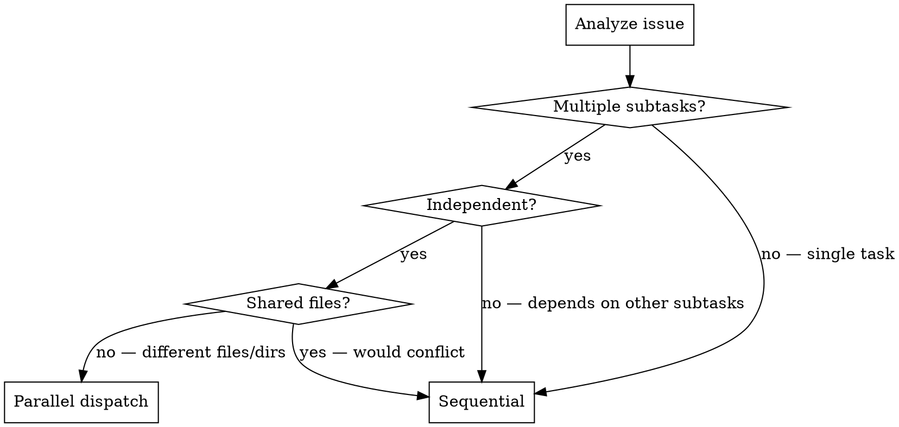

# Work on Issues

Fetch issues from the configured tracker (GitHub or GitLab), pick up work, implement it, and close completed issues. **Only main issues (titles starting with `PRD:` or `feat:`) are processed as top-level work units — one at a time, sequentially.** Other issues (e.g., `bug:`, `chore:`, unlabeled) are skipped at the top level. Within each main issue, independent subtasks are parallelized across multiple sub agents. Every sub agent automatically runs [find-mismatch](../find-mismatch/SKILL.md) after implementation — bugs are fixed immediately without prompting for confirmation.

## Detecting the Tracker

Determine the tracker at session start by checking remotes:

```bash
git remote -v
```

| Remote host | Tracker | CLI | Command prefix |
|-------------|---------|-----|----------------|
| `github.com` | GitHub Issues | `gh` | `gh issue ...` |
| `gitlab.com` | GitLab Issues | `glab` | `glab issue ...` |

Store the resolved CLI alias (`gh` or `glab`) as **`$TRACKER`** for the rest of this skill. All commands below use `$TRACKER`.

### GitLab terminology note

GitLab uses different nouns than GitHub:
- **issues** → same concept, CLI is `glab issue`
- **merge requests (MRs)** = GitHub's **pull requests (PRs)** → `glab mr` instead of `gh pr`
- **notes** = GitHub's **comments** → `glab issue note` / `glab mr note` instead of `gh issue comment` / `gh pr comment`

When commands are structurally identical, use `$TRACKER` as a shortcut. When the subcommand differs (`note` vs `comment`, `mr` vs `pr`), use the platform-specific form.

## Workflow

### Phase 1: Fetch & Triage

1. **List open issues** — fetch in machine-readable format:

   ```bash
   # GitHub — use --json for machine-readable output (NOT -F json, that flag does not exist in gh)
   gh issue list --repo <repo> --state open --json number,title,labels
   # GitLab — lists open issues by default, no --state flag
   glab issue list -O json
   ```

   For GitLab with label filtering:
   ```bash
   glab issue list --label "bug" -O json
   ```

2. **Filter for main issues only** — from the full list, keep only issues whose title starts with `PRD:` or `feat:`. These are the **main issues** that qualify for top-level processing. All other issues (e.g., `bug:`, `chore:`, `fix:`, or un-prefixed) are filtered out and **not presented as pickable work items**. Show the user only the filtered main issue list.

3. **Parse & present** — summarize each main issue: number, title, labels, brief description. Present the filtered list to the user.

4. **Let the user pick** — present the main issue list with these options:
   - Pick a specific main issue number to work on
   - Pick an issue and say **"from here onwards"** / **"this and all remaining"** to work iteratively through that main issue and every remaining main issue after it, stopping only when no main issues remain or the user interrupts
   - Suggest based on labels/priority if the user is unsure

   When "onwards" mode is selected, the orchestrator loops: dispatch sub agent for the chosen main issue → complete Phase 2–3 → automatically move to the next main issue → repeat until the list is exhausted. The user can pause or stop between main issues.

   **Important:** Only one main issue is processed at a time. The orchestrator never dispatches multiple main issues in parallel — it picks the next main issue only after the current one is fully closed.

5. **Check issue state** — before reading the full issue, verify it's still open. If it's already closed, skip it and move to the next main issue. No point implementing a resolved issue.

   ```bash
   # GitHub
   gh issue view <number> --repo <repo> --json state
   # GitLab
   glab issue view <number> -F json | jq -r '.state'
   ```

   If state is `closed` / `CLOSED`, skip to next main issue.

6. **Detect PRD (parent) issues** — if a main issue has the `PRD` label OR its title starts with `PRD:`, it is a **parent issue** that tracks sub-issues rather than containing implementation work itself. **Skip it** — do not dispatch a sub agent for it. Continue to the next main issue in the list. Track the PRD issue number for later auto-close (see PRD Auto-Close below).

   ```bash
   # GitHub — check PRD label or title prefix
   PRD_BY_LABEL=$(gh issue view <number> --repo <repo> --json labels --jq '.labels[].name' | grep -q "^PRD$" && echo "yes" || echo "no")
   PRD_BY_TITLE=$(gh issue view <number> --repo <repo> --json title --jq '.title' | grep -q "^PRD:" && echo "yes" || echo "no")

   # GitLab — check PRD label or title prefix
   PRD_BY_LABEL=$(glab issue view <number> -F json | jq -r '.labels[].name' | grep -q "^PRD$" && echo "yes" || echo "no")
   PRD_BY_TITLE=$(glab issue view <number> -F json | jq -r '.title' | grep -q "^PRD:" && echo "yes" || echo "no")
   ```

   If the issue is a PRD (by label or title):
   - **Do NOT implement it** — skip to the next issue
   - **Record its number** in a `PRD_TRACKER` list for auto-close checks
   - Present it to the user as: `#<number> [PRD] <title> (parent — skipping, sub-issues will be worked on)`

7. **Read the full issue** — load details and comments:

   ```bash
   # GitHub
   gh issue view <number> --repo <repo> --comments
   # GitLab
   glab issue view <number> --comments
   ```

   For machine-readable output: GitHub uses `--json <fields>`, GitLab uses `-F json`.

8. **Assign / label** — mark the issue as in-progress if the tracker supports it:

   ```bash
   # GitHub
   gh issue edit <number> --repo <repo> --add-label "in-progress" --remove-label "needs-triage"
   # GitLab
   glab issue update <number> --label "in-progress" --unlabel "needs-triage"
   ```

### Dependency Detection & Formal Linking

When working on a range of main issues, build a **dependency graph** from their `## Blocked by` sections. However, the orchestrator always processes main issues **one at a time, sequentially** — it never dispatches multiple main issues in parallel. Dependencies are used only to determine the correct ordering (blocked main issues are deferred until their blockers close).

1. **Issue body `## Blocked by` section** — each main issue's description may contain a `## Blocked by` heading followed by links to blocking issues. Parse these to determine which main issues must complete before others can start.

2. **Formal tracker links** — convert text-only references into native tracker relationships so the dependency graph shows up in GitLab/GitHub boards and UI.

#### Parsing Blocked-By from Issue Bodies

After fetching issues, parse each issue body for the `## Blocked by` section:

```bash
# GitHub — get issue body
gh issue view <number> --repo <repo> --json body --jq '.body'

# GitLab — get issue body
glab issue view <number> -F json | jq -r '.description'
```

Extract issue references from the `## Blocked by` section. References may appear as:
- `#42` — shorthand issue reference
- `https://github.com/owner/repo/issues/42` — full URL
- `https://gitlab.com/owner/repo/-/issues/42` — full URL

Build a **`DEPS` map** in memory (main issues only):

```
DEPS = {
  #42: [],              # feat: — no blockers — process next
  #43: [42],            # feat: — blocked by #42 — defer until #42 closes
  #44: [],              # feat: — no blockers — process after #42 (sequential, one at a time)
}
```

#### Setting Formal Tracker Links

After parsing, convert text references into formal tracker relationships so dependencies are visible in the tracker UI.

**GitLab** — use the REST API to create `is_blocked_by` links:

```bash
# Get project ID (needed for API calls)
PROJECT_ID=$(curl -s --header "PRIVATE-TOKEN: $GITLAB_TOKEN" \
  "https://gitlab.com/api/v4/projects/$(echo $REPO_PATH | sed 's/\//%2F/g')" | jq '.id')

# Create a formal "is blocked by" link
curl -s --request POST \
  --header "PRIVATE-TOKEN: $GITLAB_TOKEN" \
  --header "Content-Type: application/json" \
  --data "{\"target_project_id\": $PROJECT_ID, \"target_issue_iid\": <blocker-number>, \"link_type\": \"is_blocked_by\"}" \
  "https://gitlab.com/api/v4/projects/$PROJECT_ID/issues/<blocked-number>/links"
```

**GitHub** — use the REST API to create sub-issue links (GitHub's native dependency feature):

```bash
# GitHub — link a blocking issue via the sub-issues API
gh api repos/<owner>/<repo>/issues/<blocked-number>/sub_issues \
  --method POST \
  --field sub_issue_id=$(gh issue view <blocker-number> --repo <repo> --json id --jq '.id') \
  --field blocked_by=true
```

If the tracker API does not support formal links (or the CLI doesn't expose them), the text references in the issue body serve as the fallback — the orchestrator still uses the parsed `DEPS` map for parallelization regardless.

#### PRD Title Detection

A **PRD** issue is identified by its title starting with `PRD:` (e.g., `PRD: User Authentication System`). This is a parent/epic issue that aggregates sub-issues. Do not implement PRDs — skip them and work on their sub-issues instead.

### Phase 2: Implement (One Main Issue at a Time)

**One main issue is processed at a time.** The orchestrator picks the next unblocked main issue, dispatches a sub agent for it, waits for completion, then moves to the next. This gives each main issue a clean, focused context. Within that main issue, independent subtasks may be parallelized (see Subtask Parallelization below).

9. **Create a worktree** — always use a git worktree for issue isolation. **Never use `git checkout -b`** — worktrees keep the main working tree clean and allow parallel work. Create one in `.claude/worktrees/` with a dedicated branch:

   ```bash
   # Ensure the worktrees directory exists
   mkdir -p .claude/worktrees

   # Create worktree with a new branch
   git worktree add .claude/worktrees/issue-<number> -b work-on-issue-<number>
   ```

   **Copy environment files into the worktree** — this is mandatory, not optional. Sub agents need `.env` files to run tests, connect to databases, and access services. A worktree is a separate directory and does not inherit `.env` files from the main working tree:

   ```bash
   # ALWAYS copy .env and .env.* files — do NOT skip even if no .env exists in the main tree
   for f in .env .env.*; do [ -f "$f" ] && cp "$f" .claude/worktrees/issue-<number>/; done
   # Verify the files were copied (optional but recommended):
   ls -la .claude/worktrees/issue-<number>/.env*
   ```

   **Round-trip:** if the sub agent modifies or adds any of these env files while implementing the issue, those changes are copied **back** to the main working directory before the worktree is removed (Phase 3, step 17). Env files are gitignored, so without that propagation the change is silently lost — neither the commit nor the merge carries it.

10. **Dispatch a sub agent** to implement the main issue. Construct the prompt with everything the agent needs:

   ```markdown
   You are implementing issue #<number>: <title>.

   ## Issue Description
   <paste full issue body and acceptance criteria>

   ## Working Directory
   You are working in a git worktree at `.claude/worktrees/issue-<number>`.
   Branch `work-on-issue-<number>` is already checked out in that directory.
   All file operations (reads, edits, tests) must target paths inside this worktree.

   ## Environment Files
   `.env` and `.env.*` files have been copied into the worktree directory. You do not need to create them. If tests or services fail due to missing environment variables, check that the `.env` files are present in the worktree root before proceeding.

   ## Constraints
   - Follow the issue description and acceptance criteria exactly
   - Do NOT modify files unrelated to this issue
   - Run tests, lint, and build after implementation
   - Commit with message: "fix: resolve #<number> — <short description>"

   ## Unsure About Latest APIs or Code? Look It Up
   Do not rely on memory for library/framework APIs, syntax, versions, or current best practices — your knowledge may be stale. If you are not sure, use the tools available to you:
   - **context7** (preferred for library/framework/SDK/CLI docs) — fetch the latest documentation for the library or API in question.
   - **Web search** — for the latest code, release notes, migration guides, or breaking changes.

   Only fall back to your best judgment if neither tool is available.

   ## Reference Directories
   <If the orchestrator has added extra directories to this session via `/add-dir` or an equivalent command, list their absolute paths here. These contain a working **reference project** to consult when you get stuck. If none were added, write "None — no reference project available".>

   ## Repeated Compile/Lint Failures — Consult Reference Projects
   If the build, type-check, or lint fails **repeatedly (3+ attempts on the same error)**, do not keep guessing. A reference project may be available to unblock you:

   1. **List the additional directories** available to this session — those added via `/add-dir` or a related command are listed above under **Reference Directories**. If "None" is listed, report that you are stuck and need a reference rather than burning more attempts.
   2. **Look up the reference project** — search it for the working setup: dependency versions in `package.json`, build/bundler config, `tsconfig.json`, lint config, and how it structures the module that is failing.
   3. **Align your implementation** with the reference project's proven setup (versions, config, import paths, patterns).
   4. **Resume** — re-run the build/type-check/lint to confirm the error is resolved.

   Do not burn attempt after attempt on the same compile/lint error when a reference project exists to show you the correct configuration.

   ## Subtask Parallelization
   Before implementing, analyze whether the issue contains independent subtasks that can run in parallel (see Subtask Parallelization section below). If so, dispatch parallel sub agents for non-blocking subtasks.

   ## Post-Implementation: Find-Mismatch Review (Automatic)
   After implementation is complete and tests pass, you MUST run a find-mismatch review on all files you modified or created:

   1. **Run the find-mismatch skill** — invoke it via the Skill tool with skill name "find-mismatch"
   2. **Scope the review** — review only the files you changed (the diff). Do NOT review the entire codebase.
   3. **Automatically accept and fix** — for every real bug found:
      - Apply the fix immediately without asking for confirmation
      - Do NOT report bugs without fixing them — fix first, report fixes in your output
      - If a finding is uncertain or a false positive, skip it (only fix confirmed bugs)
   4. **Re-run tests** — after applying all fixes, re-run the test suite to confirm nothing broke
   5. **Proceed** — do not stop or wait for approval; continue to commit

   This step is mandatory and automatic. Do not skip it, do not ask whether to proceed, and do not present findings without also fixing them.

   ## Output
   Return a summary of: what you implemented, what find-mismatch fixes were applied, what tests you ran, and the commit hash.
   ```

   **Inject reference directories into the prompt:** If the user has added extra directories to this session via `/add-dir` (or an equivalent command), list their absolute paths under the **Reference Directories** section of the prompt. These are reference projects the sub agent consults when compilation or linting fails repeatedly (see the "Repeated Compile/Lint Failures" section embedded in the prompt).

   Use the `Agent` tool with `subagent_type: "full-stack-engineer"` for implementation work. The sub agent starts fresh — no context from other issues or prior conversations. The sub agent prompt includes instructions to automatically run find-mismatch after implementation and fix any bugs found. **The sub agent works inside the worktree directory** (`.claude/worktrees/issue-<number>`), not the main working tree.

   **Red Flags — do NOT do these yourself instead of dispatching:**
   - "This issue is too small for a sub agent" → Small issues benefit even more from clean context
   - "I already understand the codebase" → Understanding ≠ best implementation; fresh eyes catch things
   - "Dispatching is overhead" — The sub agent's clean context prevents cross-issue mistakes

11. **Verify** — after the sub agent returns, run verification yourself. Use [verification-before-completion](../verification-before-completion/SKILL.md) if available. Do NOT trust the sub agent's "all tests pass" claim — run the commands and confirm output. The sub agent's find-mismatch fixes are included in its commit; verify the diff looks correct.

12. **Commit** — the sub agent should commit inside the worktree. If it didn't, commit from the worktree directory:

   ```bash
   cd .claude/worktrees/issue-<number> && git commit -m "fix: resolve #<number> — <description>"
   ```

### Phase 3: Submit & Close

13. **Create a PR/MR**:

    ```bash
    # GitHub
    gh pr create --repo <repo> --title "Fix #<number>: <title>" --body "Closes #<number>"
    # GitLab
    glab mr create --title "Fix #<number>: <title>" --description "Closes #<number>"
    ```

14. **Auto-merge the PR/MR** — merge immediately after creation:

    ```bash
    # GitHub
    gh pr merge <number> --repo <repo> --squash --delete-branch
    # GitLab
    glab mr merge <number> --squash --remove-source-branch
    ```

15. **Post a summary comment** on the issue:

    ```bash
    # GitHub
    gh issue comment <number> --repo <repo> --body "Implementation complete. PR: <url>"
    # GitLab
    glab issue note <number> --message "Implementation complete. MR: <url>"
    ```

16. **Update labels and close the issue**. GitHub PRs with "Closes #<number>" in the body auto-close on merge, but do not rely on that — always explicitly close:

    Remove `needs-triage`, `in-progress`, and `ready-for-agent` labels, add `ai-agent-closed`, then close:

    ```bash
    # GitHub — explicitly close the issue (do NOT rely on PR auto-close)
    gh issue edit <number> --repo <repo> --remove-label "needs-triage,in-progress,ready-for-agent" --add-label "ai-agent-closed"
    gh issue close <number> --repo <repo> --comment "Resolved in PR <number>"

    # GitLab — remove old labels, add new label, then close
    glab issue update <number> --unlabel "needs-triage,in-progress,ready-for-agent"
    glab issue update <number> --label "ai-agent-closed"
    glab issue note <number> --message "Resolved in MR <number>"
    glab issue close <number>
    ```

17. **Propagate modified `.env` files back to the main working tree** — `.env` and `.env.*` are gitignored, so the sub agent's changes to them are **not** carried by the commit / PR / merge, and `git status` / `git diff` will not surface them. The worktree is about to be removed (step 18), which would delete those changes permanently. Before that happens, copy any env file the sub agent modified (or newly created) back to the main working directory so future worktrees inherit it.

    Run this **from the main working directory (repo root)**, not from inside the worktree:

    ```bash
    WT=.claude/worktrees/issue-<number>
    shopt -s nullglob
    propagated=()
    for wtf in "$WT"/.env "$WT"/.env.*; do
      [ -f "$wtf" ] || continue
      base=$(basename "$wtf")
      if [ ! -f "$base" ] || ! cmp -s "$base" "$wtf"; then
        cp "$wtf" "$base"
        propagated+=("$base")
      fi
    done
    shopt -u nullglob
    [ ${#propagated[@]} -gt 0 ] && echo "Propagated env files back to main: ${propagated[*]}" || echo "No env files modified in the worktree"
    ```

    **Why this is needed:** a sub agent may add a new env var (e.g., a new API key or config) that the feature requires. Without this step, that change is lost when the worktree is removed — the next worktree copies the stale main `.env` back in (step 9), and the feature breaks.

    **This never commits secrets:** env files stay gitignored. Do not `git add -f` them. The goal is local persistence across worktrees, not version control of secrets.

18. **Clean up worktree and branch**:

    ```bash
    # Remove the worktree
    git worktree remove .claude/worktrees/issue-<number>

    # Delete the branch
    git branch -d work-on-issue-<number>
    ```

### PRD Auto-Close

After closing a sub-issue, check whether any tracked PRD (parent) issues can be auto-closed. A PRD issue is ready to close when **all of its sub-issues are closed**.

19. **After closing a sub-issue**, check each PRD in `PRD_TRACKER`:

    ```bash
    # GitHub — list sub-issues linked to the PRD (issues referenced in the body or via tracker links)
    gh issue view <prd-number> --repo <repo> --json body --jq '.body'

    # GitLab
    glab issue view <prd-number> -F json | jq -r '.description'
    ```

    Parse the PRD body for referenced issue numbers (e.g., `#42`, `#43`, `#44` or `/`-prefixed links). Then check the state of each:

    ```bash
    # GitHub — check state of a referenced issue
    gh issue view <sub-issue-number> --repo <repo> --json state --jq '.state'

    # GitLab
    glab issue view <sub-issue-number> -F json | jq -r '.state'
    ```

20. **If all sub-issues are closed**, close the PRD:

    ```bash
    # GitHub
    gh issue edit <prd-number> --repo <repo> --remove-label "needs-triage,in-progress,ready-for-agent" --add-label "ai-agent-closed"
    gh issue close <prd-number> --repo <repo> --comment "All sub-issues resolved. Closing PRD."

    # GitLab
    glab issue update <prd-number> --unlabel "needs-triage,in-progress,ready-for-agent"
    glab issue update <prd-number> --label "ai-agent-closed"
    glab issue note <prd-number> --message "All sub-issues resolved. Closing PRD."
    glab issue close <prd-number>
    ```

    Remove the PRD from `PRD_TRACKER` after closing it.

**Sub-issue discovery:** If the PRD body does not explicitly list sub-issue numbers, discover them by looking for issues that reference the PRD number in their body or title:

```bash
# GitHub — search for issues referencing the PRD
gh issue list --repo <repo> --state all --search "#<prd-number>" --json number,title,state

# GitLab — search for issues referencing the PRD
glab issue list --all --search "#<prd-number>" -O json
```

## Subtask Parallelization Within an Issue

Before implementing, the sub agent (or orchestrator) should analyze the issue for independent subtasks.

### When to Parallelize


```dot
digraph subtask_parallel {
    "Analyze issue" [shape=box];
    "Multiple subtasks?" [shape=diamond];
    "Independent?" [shape=diamond];
    "Shared files?" [shape=diamond];
    "Sequential" [shape=box];
    "Parallel dispatch" [shape=box];

    "Analyze issue" -> "Multiple subtasks?";
    "Multiple subtasks?" -> "Independent?" [label="yes"];
    "Multiple subtasks?" -> "Sequential" [label="no — single task"];
    "Independent?" -> "Shared files?" [label="yes"];
    "Independent?" -> "Sequential" [label="no — depends on other subtasks"];
    "Shared files?" -> "Parallel dispatch" [label="no — different files/dirs"];
    "Shared files?" -> "Sequential" [label="yes — would conflict"];
}
```

**Parallelize when:**
- Issue touches multiple files or directories that don't depend on each other
- Subtask A's output is not required as input for subtask B
- Example: "Add validation to form AND update API error messages" — these are independent

**Keep sequential when:**
- Subtasks share the same files (agents would conflict)
- One subtask's output feeds into the next (e.g., write model, then write migration)
- Order matters (e.g., refactor first, then add feature on top)

### How to Dispatch Parallel Subtasks

When the sub agent identifies parallelizable subtasks, it dispatches child agents:

1. **Decompose** — break the issue into subtasks with clear boundaries:

   ```markdown
   Issue #42: "Add user profile page and email notifications"

   Subtask A: User profile page (files: src/pages/Profile.tsx, src/api/profile.ts)
   Subtask B: Email notifications (files: src/services/email.ts, src/templates/)
   → Independent, no shared files → PARALLEL
   ```

2. **Dispatch** — use the Agent tool with `subagent_type: "full-stack-engineer"` for each subtask in a **single message** (parallel dispatch):

   ```
   Agent A: "Implement the user profile page for issue #42..."
   Agent B: "Implement email notifications for issue #42..."
   ```

3. **Constrain each sub agent** — specify exact file/directory boundaries to prevent conflicts:

   ```markdown
   ## Your Scope
   Files you MAY modify: src/services/email.ts, src/templates/
   Files you MUST NOT modify: src/pages/, src/api/profile.ts (another agent is working on these)

   ## Deliverable
   Implement [specific subtask]. Run relevant tests. Return summary of changes.
   ```

4. **Integrate** — after all parallel sub agents return, verify no conflicts and run the full test suite.

### Subtask Prompt Template

```markdown
You are implementing a subtask of issue #<number>: <title>.

## Subtask: <specific subtask description>

## Working Directory
You are working in a git worktree at `.claude/worktrees/issue-<number>`.
`.env` and `.env.*` files are already present in the worktree root.

## Reference Directories
<If extra directories were added to this session via `/add-dir` or a related command, list their absolute paths here; otherwise write "None".>

## Unsure About Latest APIs or Code? Look It Up
Do not rely on memory for library/framework APIs, syntax, or versions — your knowledge may be stale. If unsure, use **context7** (preferred) for library/framework/SDK/CLI docs, or **web search** for the latest code, release notes, migration guides, or breaking changes. Fall back to your best judgment only if neither is available.

## Scope
- Files you MAY modify: <list>
- Files you MUST NOT modify: <list> (another agent is handling these)

## Repeated Compile/Lint Failures — Consult Reference Projects
If the build, type-check, or lint fails **repeatedly (3+ attempts on the same error)**, stop guessing:
1. **List the additional directories** available to this session — those added via `/add-dir` or a related command (listed above under **Reference Directories**).
2. **Look up the reference project** for the working setup: dependency versions, build/bundler config, `tsconfig.json`, lint config, and how it structures the failing module.
3. **Align your implementation** with the reference project's proven setup, then re-run the build/type-check/lint.
If no reference directories were provided, report that you are stuck rather than burning more attempts.

## Requirements
<paste relevant acceptance criteria for this subtask only>

## Post-Implementation: Find-Mismatch Review (Automatic)
After your implementation is complete, you MUST run a find-mismatch review on the files you modified:

1. **Run the find-mismatch skill** — invoke it via the Skill tool with skill name "find-mismatch"
2. **Scope the review** — review only the files within your scope that you changed
3. **Automatically accept and fix** — fix every confirmed bug immediately without asking for confirmation
4. **Re-run tests** — confirm fixes don't break anything
5. **Proceed** — do not stop or wait for approval

## Verification
Run tests relevant to your subtask. Return:
1. What you implemented
2. Find-mismatch fixes applied (if any)
3. Files modified
4. Test results
```

## Batch Mode

When the user wants to work through multiple issues:

1. Fetch the full open list (Phase 1).
2. **Filter for main issues only** — keep only issues whose title starts with `PRD:` or `feat:`. Discard all others.
3. **Build the dependency graph** — parse `## Blocked by` sections from all main issue bodies (see Dependency Detection & Formal Linking). Build the `DEPS` map and `PRD_TRACKER` list.
4. **Set formal tracker links** — convert text-only blocked-by references into native GitLab/GitHub relationships.
5. **Process main issues one at a time** (see below).
6. Between main issues, check with the user before proceeding.
7. Maintain a summary table:

   | Issue | Title | Type | Blocked By | Agent | Status | PR/MR |
   |-------|-------|------|------------|-------|--------|-------|
   | #12 | feat: Setup DB schema | feat | — | Agent-1 | ✅ Closed | !34 |
   | #13 | feat: Add API routes | feat | #12 | Agent-2 | 🔄 In Progress | — |
   | #14 | bug: Fix typo | bug | — | — | ⏭ Skipped | — |
   | #15 | feat: Add auth middleware | feat | #12, #13 | ⏳ Pending | — |

   Non-main issues (rows without `PRD:` or `feat:` prefix) appear as "Skipped" in the table.

### Sequential Main-Issue Dispatch (One at a Time)

The orchestrator processes main issues **strictly one at a time** — never in parallel across issues. The `DEPS` map determines the order (blocked main issues are deferred), but only one main issue is ever active at a time. Subtask parallelization within that single main issue still applies.

```
Build DEPS map from main issue bodies → Loop:
  1. Find the next main issue with zero unresolved blockers (DEPS[issue] is empty OR all blockers are closed)
  2. If no unblocked main issues remain AND unresolved main issues exist → report blockers → break to user
  3. If all main issues are closed → done
  4. Dispatch a single sub agent for the selected main issue
     - Agent gets its own worktree: .claude/worktrees/issue-<number> with branch work-on-issue-<number>
     - Within this issue, the sub agent may parallelize independent subtasks (see Subtask Parallelization)
  5. Wait for the sub agent to complete
  6. Verify, create PR/MR, merge, close issue, propagate modified .env/.env.* back to main, clean up branch
  7. PRD auto-close check — check if any PRD in PRD_TRACKER has all sub-issues closed
  8. Re-evaluate DEPS — main issues whose blockers are now all closed become eligible
  9. Go to step 1 (pick next unblocked main issue)
```

**Ordering example:**

```
Main issues only: DEPS = { #12 (feat): [], #13 (feat): [#12], #14 (feat): [#12] }

Step 1: #12 has no blockers → dispatch sub agent for #12
  → #12 completes, merged, closed

Step 2: #13 and #14 now unblocked → pick #13 (lowest number) → dispatch sub agent for #13
  → #13 completes, merged, closed

Step 3: #14 still unblocked → dispatch sub agent for #14
  → #14 completes, merged, closed

All main issues done. Check PRD auto-close.
```

**Why one at a time:**
- **No merge conflicts** — only one branch is active at a time, so there's no competition for the same files.
- **Predictable ordering** — the user always knows which issue is being worked on.
- **Clean context** — each main issue gets the orchestrator's full attention.

### Iterative Onwards Mode

When the user picks "issue X onwards", the orchestrator enters a **continuous outer loop** — it keeps processing main issues and re-fetching until the tracker is empty or the user stops. New main issues filed during work are automatically picked up in the next refresh.

```
OUTER LOOP (never stops until tracker is empty or user says stop):

  1. Fetch ALL open issues from tracker
  2. If no open issues exist → report "All issues resolved" → STOP
  3. Filter to MAIN issues only (title starts with PRD: or feat:)
  4. If no main issues remain → report "No main issues remaining" → STOP
  5. Filter to issues >= starting number (honour "onwards")
  6. Build PRD_TRACKER from PRD-titled/labeled issues
  7. Parse all main issue bodies → Build DEPS map
  8. Set formal tracker links (if not already linked)

  INNER LOOP (one main issue at a time):
    a. Find the next unblocked main issue (DEPS empty or all blockers closed, lowest number first)
    b. Skip closed issues, skip PRDs
    c. If no unblocked main issues remain AND unresolved main issues exist → report blockers → break to user
    d. If no main issues remain at all → break inner loop
    e. Dispatch ONE sub agent for the selected main issue
    f. Sub agent: implement (may parallelize subtasks internally), find-mismatch, commit
    g. Verify, create PR/MR, merge, close issue, propagate modified .env/.env.* back to main working tree, clean up worktree and branch
    h. PRD auto-close check
    i. Re-evaluate DEPS → back to step (a)

  9. Inner loop done → brief user: "Main issues processed. Re-fetching..."
  10. Go back to step 1 (OUTER LOOP re-fetches everything)
```

**Loop behavior:**
- **Main issues only** — only issues whose title starts with `PRD:` or `feat:` are considered. All other issues are ignored at the top level.
- **One at a time** — only one main issue is dispatched at a time. The orchestrator waits for it to complete before picking the next.
- **Continuous refresh** — after every main issue completes and the inner loop finishes, the orchestrator re-fetches the full open issue list. If new main issues have been filed, they are automatically picked up.
- **Never stops early** — the loop only exits when the tracker returns zero open main issues OR the user says "stop".
- **Skip closed issues** — before dispatching a sub agent, check the issue state. If it's already closed, skip it immediately.
- **Skip PRD (parent) issues** — if an issue's title starts with `PRD:` or has the `PRD` label, record it in `PRD_TRACKER` and skip (PRDs are not implemented, only tracked for auto-close).
- **Auto-close PRDs** — after each sub-issue is closed, check every PRD in `PRD_TRACKER` to see if all its sub-issues are now closed. If they are, close the PRD automatically.
- **Respect dependency order** — never dispatch a main issue whose blockers are still open.
- Between main issues, give the user a status update and a chance to pause/stop.
- If the user says "stop" or "skip" at any point, break out of the loop.
- **Onwards range** — the `>= starting number` filter is re-applied on each outer loop refresh, so newly filed main issues with numbers >= the starting issue are included.

#### Refresh Query

After each outer loop iteration, re-fetch all open issues:

```bash
# GitHub — re-fetch all open issues
gh issue list --repo <repo> --state open --json number,title,labels

# GitLab — re-fetch all open issues
glab issue list -O json
```

If the result is empty → announce "All issues resolved. No open issues remaining." → exit.
If the result contains new issues → announce "Found N new open issues" → continue inner loop.

### Single Issue Mode

When the user picks a single main issue (not a range), run it solo — no dependency parsing needed. Subtask parallelization within that single issue still applies.

## Label Conventions

| Label | Meaning | Default Color |
|-------|---------|---------------|
| `PRD` | Parent issue — tracks sub-issues, not implementation work | `#0075CA` |
| `in-progress` | Currently being worked on | `#E4E669` |
| `ready-for-agent` | Issue is ready for autonomous agent implementation | `#0E8A16` |
| `ready-for-review` | Implementation done, awaiting merge | `#0E8A16` |
| `blocked` | Cannot proceed (needs info, dependency, etc.) | `#D93F0B` |
| `ai-agent-closed` | Issue closed by AI agent | `#5319E7` |

Apply/remove as the issue moves through states.

### Auto-create labels

If a label does not exist, create it before applying:

```bash
# GitHub
gh label create "in-progress" --repo <repo> --color "#E4E669" --description "Currently being worked on"
# GitLab
glab label create --name "in-progress" --color "#E4E669" --description "Currently being worked on"
```

Use the same pattern for `PRD` (`#0075CA`), `ready-for-agent` (`#0E8A16`), `ready-for-review` (`#0E8A16`), `blocked` (`#D93F0B`), and `ai-agent-closed` (`#5319E7`).

**Shortcut:** wrap label application in a helper — try to apply, and if the CLI reports "not found", create it first then retry:

```bash
# GitHub helper pattern
gh issue edit <number> --repo <repo> --add-label "in-progress" || \
  (gh label create "in-progress" --repo <repo> --color "#E4E669" --description "Currently being worked on" && \
   gh issue edit <number> --repo <repo> --add-label "in-progress")

# GitLab helper pattern
glab issue update <number> --label "in-progress" || \
  (glab label create --name "in-progress" --color "#E4E669" --description "Currently being worked on" && \
   glab issue update <number> --label "in-progress")
```

## Edge Cases

- **No tracker CLI installed** — fall back to API calls or ask the user to install `gh`/`glab`.
- **Multiple remotes** — let the user specify which tracker to use.
- **Issue already assigned** — skip the assignment step.
- **Issue needs clarification** — comment/note on the issue asking for details, then pause implementation.
- **Partially done** — if an issue is too large, break it into sub-issues or a checklist and track progress in a comment/note.
- **No `## Blocked by` section** — treat the issue as having no blockers (empty DEPS entry). It can be dispatched immediately.
- **Circular dependency** — if the DEPS map contains a cycle (e.g., A blocked by B, B blocked by A), report it to the user and skip both issues. Do not attempt to dispatch.
- **External blocker** — if a blocked-by reference points to an issue outside the selected range, check its state. If it's already closed, ignore it. If it's open, treat it as an unresolved blocker.
- **Formal link API failure** — if setting native tracker links fails, fall back to text-only references. The DEPS map still works for ordering.
- **No main issues found** — if after filtering for `PRD:`/`feat:` prefixed issues, the list is empty, report to the user: "No main issues (PRD: or feat:) found in the tracker. All open issues are non-main types (bug:, chore:, etc.)." Ask the user if they want to process specific non-main issues.
- **User wants to work on a non-main issue** — if the user explicitly picks a non-main issue by number, honor their choice. The `PRD:`/`feat:` filter only applies to automatic/batch selection, not to explicit user picks.
- **Sub agent modified `.env` / `.env.*`** — these files are gitignored, so the change never appears in `git status`/`git diff` and is not carried by the commit, PR, or merge. Phase 3 step 17 explicitly copies any modified or newly-created env file from the worktree back to the main working directory **before** the worktree is removed. Files stay gitignored (never `git add -f`); the goal is local persistence across worktrees, not committing secrets. This step must run before `git worktree remove` — after removal the files are gone.
