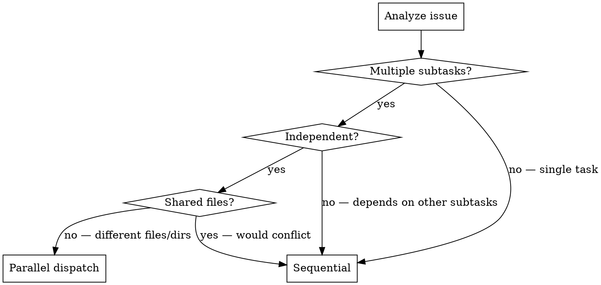

# Work on Issues

Fetch issues from the configured tracker (GitHub or GitLab), pick up work, implement it, and close completed issues. Each issue is handled by a dedicated sub agent so every agent starts with a clear, focused context. Within each issue, independent subtasks are parallelized across multiple sub agents. Every sub agent automatically runs [find-mismatch](../find-mismatch/SKILL.md) after implementation — bugs are fixed immediately without prompting for confirmation.

## Detecting the Tracker

Determine the tracker at session start by checking remotes:

```bash
git remote -v
```

| Remote host | Tracker | CLI | Command prefix |
|-------------|---------|-----|----------------|
| `github.com` | GitHub Issues | `gh` | `gh issue ...` |
| `gitlab.com` | GitLab Issues | `glab` | `glab issue ...` |

Store the resolved CLI alias (`gh` or `glab`) as **`$TRACKER`** for the rest of this skill. All commands below use `$TRACKER`.

### GitLab terminology note

GitLab uses different nouns than GitHub:
- **issues** → same concept, CLI is `glab issue`
- **merge requests (MRs)** = GitHub's **pull requests (PRs)** → `glab mr` instead of `gh pr`
- **notes** = GitHub's **comments** → `glab issue note` / `glab mr note` instead of `gh issue comment` / `gh pr comment`

When commands are structurally identical, use `$TRACKER` as a shortcut. When the subcommand differs (`note` vs `comment`, `mr` vs `pr`), use the platform-specific form.

## Workflow

### Phase 1: Fetch & Triage

1. **List open issues** — fetch in machine-readable format:

   ```bash
   # GitHub — use --json for machine-readable output (NOT -F json, that flag does not exist in gh)
   gh issue list --repo <repo> --state open --json number,title,labels
   # GitLab — lists open issues by default, no --state flag
   glab issue list -O json
   ```

   For GitLab with label filtering:
   ```bash
   glab issue list --label "bug" -O json
   ```

2. **Parse & present** — summarize each issue: number, title, labels, brief description. Present the list to the user.

3. **Let the user pick** — present the issue list with these options:
   - Pick a specific issue number to work on
   - Pick an issue and say **"from here onwards"** / **"this and all remaining"** to work iteratively through that issue and every open issue after it, stopping only when no issues remain or the user interrupts
   - Suggest based on labels/priority if the user is unsure

   When "onwards" mode is selected, the orchestrator loops: dispatch sub agent for the chosen issue → complete Phase 2–3 → automatically move to the next open issue → repeat until the list is exhausted. The user can pause or stop between issues.

4. **Check issue state** — before reading the full issue, verify it's still open. If it's already closed, skip it and move to the next one. No point implementing a resolved issue.

   ```bash
   # GitHub
   gh issue view <number> --repo <repo> --json state
   # GitLab
   glab issue view <number> -F json | jq -r '.state'
   ```

   If state is `closed` / `CLOSED`, skip to next issue.

5. **Detect PRD (parent) issues** — if an issue has the `PRD` label OR its title starts with `PRD:`, it is a **parent issue** that tracks sub-issues rather than containing implementation work itself. **Skip it** — do not dispatch a sub agent for it. Continue to the next issue in the list. Track the PRD issue number for later auto-close (see PRD Auto-Close below).

   ```bash
   # GitHub — check PRD label or title prefix
   PRD_BY_LABEL=$(gh issue view <number> --repo <repo> --json labels --jq '.labels[].name' | grep -q "^PRD$" && echo "yes" || echo "no")
   PRD_BY_TITLE=$(gh issue view <number> --repo <repo> --json title --jq '.title' | grep -q "^PRD:" && echo "yes" || echo "no")

   # GitLab — check PRD label or title prefix
   PRD_BY_LABEL=$(glab issue view <number> -F json | jq -r '.labels[].name' | grep -q "^PRD$" && echo "yes" || echo "no")
   PRD_BY_TITLE=$(glab issue view <number> -F json | jq -r '.title' | grep -q "^PRD:" && echo "yes" || echo "no")
   ```

   If the issue is a PRD (by label or title):
   - **Do NOT implement it** — skip to the next issue
   - **Record its number** in a `PRD_TRACKER` list for auto-close checks
   - Present it to the user as: `#<number> [PRD] <title> (parent — skipping, sub-issues will be worked on)`

6. **Read the full issue** — load details and comments:

   ```bash
   # GitHub
   gh issue view <number> --repo <repo> --comments
   # GitLab
   glab issue view <number> --comments
   ```

   For machine-readable output: GitHub uses `--json <fields>`, GitLab uses `-F json`.

7. **Assign / label** — mark the issue as in-progress if the tracker supports it:

   ```bash
   # GitHub
   gh issue edit <number> --repo <repo> --add-label "in-progress" --remove-label "needs-triage"
   # GitLab
   glab issue update <number> --label "in-progress" --unlabel "needs-triage"
   ```

### Dependency Detection & Formal Linking

When working on a range of issues, build a **dependency graph** so the orchestrator can dispatch unblocked issues in parallel. Dependencies come from two sources:

1. **Issue body `## Blocked by` section** — each issue's description may contain a `## Blocked by` heading followed by links to blocking issues. Parse these to determine which issues must complete before others can start.

2. **Formal tracker links** — convert text-only references into native tracker relationships so the dependency graph shows up in GitLab/GitHub boards and UI.

#### Parsing Blocked-By from Issue Bodies

After fetching issues, parse each issue body for the `## Blocked by` section:

```bash
# GitHub — get issue body
gh issue view <number> --repo <repo> --json body --jq '.body'

# GitLab — get issue body
glab issue view <number> -F json | jq -r '.description'
```

Extract issue references from the `## Blocked by` section. References may appear as:
- `#42` — shorthand issue reference
- `https://github.com/owner/repo/issues/42` — full URL
- `https://gitlab.com/owner/repo/-/issues/42` — full URL

Build a **`DEPS` map** in memory:

```
DEPS = {
  #42: [],              # no blockers — can start immediately
  #43: [42],            # blocked by #42
  #44: [42],            # blocked by #42
  #45: [43, 44],        # blocked by both #43 and #44
}
```

#### Setting Formal Tracker Links

After parsing, convert text references into formal tracker relationships so dependencies are visible in the tracker UI.

**GitLab** — use the REST API to create `is_blocked_by` links:

```bash
# Get project ID (needed for API calls)
PROJECT_ID=$(curl -s --header "PRIVATE-TOKEN: $GITLAB_TOKEN" \
  "https://gitlab.com/api/v4/projects/$(echo $REPO_PATH | sed 's/\//%2F/g')" | jq '.id')

# Create a formal "is blocked by" link
curl -s --request POST \
  --header "PRIVATE-TOKEN: $GITLAB_TOKEN" \
  --header "Content-Type: application/json" \
  --data "{\"target_project_id\": $PROJECT_ID, \"target_issue_iid\": <blocker-number>, \"link_type\": \"is_blocked_by\"}" \
  "https://gitlab.com/api/v4/projects/$PROJECT_ID/issues/<blocked-number>/links"
```

**GitHub** — use the REST API to create sub-issue links (GitHub's native dependency feature):

```bash
# GitHub — link a blocking issue via the sub-issues API
gh api repos/<owner>/<repo>/issues/<blocked-number>/sub_issues \
  --method POST \
  --field sub_issue_id=$(gh issue view <blocker-number> --repo <repo> --json id --jq '.id') \
  --field blocked_by=true
```

If the tracker API does not support formal links (or the CLI doesn't expose them), the text references in the issue body serve as the fallback — the orchestrator still uses the parsed `DEPS` map for parallelization regardless.

#### PRD Title Detection

A **PRD** issue is identified by its title starting with `PRD:` (e.g., `PRD: User Authentication System`). This is a parent/epic issue that aggregates sub-issues. Do not implement PRDs — skip them and work on their sub-issues instead.

### Phase 2: Implement (Sub Agent Per Issue)

**Every issue gets its own sub agent.** This gives each agent a clean, focused context — no pollution from previous issues, no accumulated baggage. The orchestrator (you) coordinates; the sub agent executes.

8. **Create a branch** — use the issue number in the branch name:

   ```bash
   git checkout -b work-on-issue-<number>
   ```

9. **Dispatch a sub agent** to implement the issue. Construct the prompt with everything the agent needs:

   ```markdown
   You are implementing issue #<number>: <title>.

   ## Issue Description
   <paste full issue body and acceptance criteria>

   ## Branch
   work-on-issue-<number> (already checked out)

   ## Constraints
   - Follow the issue description and acceptance criteria exactly
   - Do NOT modify files unrelated to this issue
   - Run tests, lint, and build after implementation
   - Commit with message: "fix: resolve #<number> — <short description>"

   ## Subtask Parallelization
   Before implementing, analyze whether the issue contains independent subtasks that can run in parallel (see Subtask Parallelization section below). If so, dispatch parallel sub agents for non-blocking subtasks.

   ## Post-Implementation: Find-Mismatch Review (Automatic)
   After implementation is complete and tests pass, you MUST run a find-mismatch review on all files you modified or created:

   1. **Run the find-mismatch skill** — invoke it via the Skill tool with skill name "find-mismatch"
   2. **Scope the review** — review only the files you changed (the diff). Do NOT review the entire codebase.
   3. **Automatically accept and fix** — for every real bug found:
      - Apply the fix immediately without asking for confirmation
      - Do NOT report bugs without fixing them — fix first, report fixes in your output
      - If a finding is uncertain or a false positive, skip it (only fix confirmed bugs)
   4. **Re-run tests** — after applying all fixes, re-run the test suite to confirm nothing broke
   5. **Proceed** — do not stop or wait for approval; continue to commit

   This step is mandatory and automatic. Do not skip it, do not ask whether to proceed, and do not present findings without also fixing them.

   ## Output
   Return a summary of: what you implemented, what find-mismatch fixes were applied, what tests you ran, and the commit hash.
   ```

   Use the `Agent` tool with `subagent_type: "full-stack-engineer"` for implementation work. The sub agent starts fresh — no context from other issues or prior conversations. The sub agent prompt includes instructions to automatically run find-mismatch after implementation and fix any bugs found.

   **Red Flags — do NOT do these yourself instead of dispatching:**
   - "This issue is too small for a sub agent" → Small issues benefit even more from clean context
   - "I already understand the codebase" → Understanding ≠ best implementation; fresh eyes catch things
   - "Dispatching is overhead" — The sub agent's clean context prevents cross-issue mistakes

10. **Verify** — after the sub agent returns, run verification yourself. Use [verification-before-completion](../verification-before-completion/SKILL.md) if available. Do NOT trust the sub agent's "all tests pass" claim — run the commands and confirm output. The sub agent's find-mismatch fixes are included in its commit; verify the diff looks correct.

11. **Commit** — the sub agent should commit. If it didn't, commit with:

   ```bash
   git commit -m "fix: resolve #<number> — <description>"
   ```

### Phase 3: Submit & Close

12. **Create a PR/MR**:

    ```bash
    # GitHub
    gh pr create --repo <repo> --title "Fix #<number>: <title>" --body "Closes #<number>"
    # GitLab
    glab mr create --title "Fix #<number>: <title>" --description "Closes #<number>"
    ```

13. **Auto-merge the PR/MR** — merge immediately after creation:

    ```bash
    # GitHub
    gh pr merge <number> --repo <repo> --squash --delete-branch
    # GitLab
    glab mr merge <number> --squash --remove-source-branch
    ```

14. **Post a summary comment** on the issue:

    ```bash
    # GitHub
    gh issue comment <number> --repo <repo> --body "Implementation complete. PR: <url>"
    # GitLab
    glab issue note <number> --message "Implementation complete. MR: <url>"
    ```

15. **Update labels and close the issue**. GitHub PRs with "Closes #<number>" in the body auto-close on merge, but do not rely on that — always explicitly close:

    Remove `needs-triage`, `in-progress`, and `ready-for-agent` labels, add `ai-agent-closed`, then close:

    ```bash
    # GitHub — explicitly close the issue (do NOT rely on PR auto-close)
    gh issue edit <number> --repo <repo> --remove-label "needs-triage,in-progress,ready-for-agent" --add-label "ai-agent-closed"
    gh issue close <number> --repo <repo> --comment "Resolved in PR <number>"

    # GitLab — remove old labels, add new label, then close
    glab issue update <number> --unlabel "needs-triage,in-progress,ready-for-agent"
    glab issue update <number> --label "ai-agent-closed"
    glab issue note <number> --message "Resolved in MR <number>"
    glab issue close <number>
    ```

16. **Clean up branch**:

    ```bash
    git branch -d work-on-issue-<number>
    ```

### PRD Auto-Close

After closing a sub-issue, check whether any tracked PRD (parent) issues can be auto-closed. A PRD issue is ready to close when **all of its sub-issues are closed**.

17. **After closing a sub-issue**, check each PRD in `PRD_TRACKER`:

    ```bash
    # GitHub — list sub-issues linked to the PRD (issues referenced in the body or via tracker links)
    gh issue view <prd-number> --repo <repo> --json body --jq '.body'

    # GitLab
    glab issue view <prd-number> -F json | jq -r '.description'
    ```

    Parse the PRD body for referenced issue numbers (e.g., `#42`, `#43`, `#44` or `/`-prefixed links). Then check the state of each:

    ```bash
    # GitHub — check state of a referenced issue
    gh issue view <sub-issue-number> --repo <repo> --json state --jq '.state'

    # GitLab
    glab issue view <sub-issue-number> -F json | jq -r '.state'
    ```

18. **If all sub-issues are closed**, close the PRD:

    ```bash
    # GitHub
    gh issue edit <prd-number> --repo <repo> --remove-label "needs-triage,in-progress,ready-for-agent" --add-label "ai-agent-closed"
    gh issue close <prd-number> --repo <repo> --comment "All sub-issues resolved. Closing PRD."

    # GitLab
    glab issue update <prd-number> --unlabel "needs-triage,in-progress,ready-for-agent"
    glab issue update <prd-number> --label "ai-agent-closed"
    glab issue note <prd-number> --message "All sub-issues resolved. Closing PRD."
    glab issue close <prd-number>
    ```

    Remove the PRD from `PRD_TRACKER` after closing it.

**Sub-issue discovery:** If the PRD body does not explicitly list sub-issue numbers, discover them by looking for issues that reference the PRD number in their body or title:

```bash
# GitHub — search for issues referencing the PRD
gh issue list --repo <repo> --state all --search "#<prd-number>" --json number,title,state

# GitLab — search for issues referencing the PRD
glab issue list --all --search "#<prd-number>" -O json
```

## Subtask Parallelization Within an Issue

Before implementing, the sub agent (or orchestrator) should analyze the issue for independent subtasks.

### When to Parallelize


```dot
digraph subtask_parallel {
    "Analyze issue" [shape=box];
    "Multiple subtasks?" [shape=diamond];
    "Independent?" [shape=diamond];
    "Shared files?" [shape=diamond];
    "Sequential" [shape=box];
    "Parallel dispatch" [shape=box];

    "Analyze issue" -> "Multiple subtasks?";
    "Multiple subtasks?" -> "Independent?" [label="yes"];
    "Multiple subtasks?" -> "Sequential" [label="no — single task"];
    "Independent?" -> "Shared files?" [label="yes"];
    "Independent?" -> "Sequential" [label="no — depends on other subtasks"];
    "Shared files?" -> "Parallel dispatch" [label="no — different files/dirs"];
    "Shared files?" -> "Sequential" [label="yes — would conflict"];
}
```

**Parallelize when:**
- Issue touches multiple files or directories that don't depend on each other
- Subtask A's output is not required as input for subtask B
- Example: "Add validation to form AND update API error messages" — these are independent

**Keep sequential when:**
- Subtasks share the same files (agents would conflict)
- One subtask's output feeds into the next (e.g., write model, then write migration)
- Order matters (e.g., refactor first, then add feature on top)

### How to Dispatch Parallel Subtasks

When the sub agent identifies parallelizable subtasks, it dispatches child agents:

1. **Decompose** — break the issue into subtasks with clear boundaries:

   ```markdown
   Issue #42: "Add user profile page and email notifications"

   Subtask A: User profile page (files: src/pages/Profile.tsx, src/api/profile.ts)
   Subtask B: Email notifications (files: src/services/email.ts, src/templates/)
   → Independent, no shared files → PARALLEL
   ```

2. **Dispatch** — use the Agent tool with `subagent_type: "full-stack-engineer"` for each subtask in a **single message** (parallel dispatch):

   ```
   Agent A: "Implement the user profile page for issue #42..."
   Agent B: "Implement email notifications for issue #42..."
   ```

3. **Constrain each sub agent** — specify exact file/directory boundaries to prevent conflicts:

   ```markdown
   ## Your Scope
   Files you MAY modify: src/services/email.ts, src/templates/
   Files you MUST NOT modify: src/pages/, src/api/profile.ts (another agent is working on these)

   ## Deliverable
   Implement [specific subtask]. Run relevant tests. Return summary of changes.
   ```

4. **Integrate** — after all parallel sub agents return, verify no conflicts and run the full test suite.

### Subtask Prompt Template

```markdown
You are implementing a subtask of issue #<number>: <title>.

## Subtask: <specific subtask description>

## Scope
- Files you MAY modify: <list>
- Files you MUST NOT modify: <list> (another agent is handling these)

## Requirements
<paste relevant acceptance criteria for this subtask only>

## Post-Implementation: Find-Mismatch Review (Automatic)
After your implementation is complete, you MUST run a find-mismatch review on the files you modified:

1. **Run the find-mismatch skill** — invoke it via the Skill tool with skill name "find-mismatch"
2. **Scope the review** — review only the files within your scope that you changed
3. **Automatically accept and fix** — fix every confirmed bug immediately without asking for confirmation
4. **Re-run tests** — confirm fixes don't break anything
5. **Proceed** — do not stop or wait for approval

## Verification
Run tests relevant to your subtask. Return:
1. What you implemented
2. Find-mismatch fixes applied (if any)
3. Files modified
4. Test results
```

## Batch Mode

When the user wants to work through multiple issues:

1. Fetch the full open list (Phase 1).
2. **Build the dependency graph** — parse `## Blocked by` sections from all issue bodies (see Dependency Detection & Formal Linking). Build the `DEPS` map and `PRD_TRACKER` list.
3. **Set formal tracker links** — convert text-only blocked-by references into native GitLab/GitHub relationships.
4. **Dispatch issues using dependency-aware scheduling** (see below).
5. Between waves, check with the user before proceeding.
6. Maintain a summary table:

   | Issue | Title | Blocked By | Agent | Status | PR/MR |
   |-------|-------|------------|-------|--------|-------|
   | #12 | Setup DB schema | — | Agent-1 | ✅ Closed | !34 |
   | #13 | Add API routes | — | Agent-2 | ✅ Closed | !35 |
   | #14 | Add auth middleware | #12, #13 | Agent-3 | 🔄 In Progress | — |
   | #15 | Add UI login page | #13 | Agent-4 | 🔄 In Progress | — |
   | #16 | Integration tests | #14, #15 | ⏳ Pending | — |

### Dependency-Aware Parallel Dispatch

Instead of running all issues strictly sequentially, the orchestrator uses the `DEPS` map to maximize parallelism:

```
Build DEPS map from all issue bodies → Loop:
  1. Find all issues with zero unresolved blockers (DEPS[issue] is empty OR all blockers are closed)
  2. Dispatch a sub agent for each unblocked issue IN PARALLEL (single message with multiple Agent calls)
     - Each agent gets its own branch: work-on-issue-<number>
     - Each agent is constrained to its issue scope
  3. Wait for all dispatched agents to complete
  4. For each completed agent: verify, create PR/MR, merge, close issue, clean up branch
  5. PRD auto-close check — check if any PRD in PRD_TRACKER has all sub-issues closed
  6. Re-evaluate DEPS — issues whose blockers are now all closed become unblocked
  7. If any unblocked issues remain → dispatch next wave (go to step 2)
  8. If no unblocked issues remain AND unresolved issues exist → blocked, report to user
  9. If all issues are closed → done
```

**Wave example:**

```
DEPS = { #12: [], #13: [], #14: [#12, #13], #15: [#13], #16: [#14, #15] }

Wave 1: #12 and #13 have no blockers → dispatch both in parallel
  → #12 completes, #13 completes

Wave 2: #14 (was blocked by #12,#13 — now unblocked) and #15 (was blocked by #13 — now unblocked) → dispatch both in parallel
  → #14 completes, #15 completes

Wave 3: #16 (was blocked by #14,#15 — now unblocked) → dispatch
  → #16 completes

All done. Check PRD auto-close.
```

**Important constraints for parallel issue dispatch:**
- **Each issue MUST have its own git branch** — agents must not share branches. Use `work-on-issue-<number>` for each.
- **Merge conflicts** — if two parallel agents modify the same files, the second to merge will conflict. The orchestrator must handle this: merge the first, then rebase/resolve the second before merging.
- **Shared code conflicts** — if two issues likely touch the same files, keep them sequential even if the DEPS map says they're parallel. Check the issue descriptions for file overlap before dispatching in parallel.
- **Maximum parallelism** — dispatch at most 3-4 issues in parallel to avoid resource exhaustion and merge conflicts.

### Iterative Onwards Mode

When the user picks "issue X onwards", the orchestrator enters a **continuous outer loop** — it keeps processing issues and re-fetching until the tracker is empty or the user stops. New issues filed during work are automatically picked up in the next refresh.

```
OUTER LOOP (never stops until tracker is empty or user says stop):

  1. Fetch ALL open issues from tracker
  2. If no open issues exist → report "All issues resolved" → STOP
  3. Filter to issues >= starting number (honour "onwards")
  4. Build PRD_TRACKER from PRD-titled/labeled issues
  5. Parse all issue bodies → Build DEPS map
  6. Set formal tracker links (if not already linked)

  INNER LOOP (wave-based dispatch):
    a. Find all unblocked issues (DEPS empty or all blockers closed)
    b. Skip closed issues, skip PRDs
    c. If no unblocked issues remain AND unresolved issues exist → report blockers → break to user
    d. If no issues remain at all → break inner loop
    e. Dispatch sub agents for all unblocked issues IN PARALLEL
    f. Each sub agent: implement, find-mismatch, commit
    g. For each completed agent: verify, create PR/MR, merge, close issue, clean up branch
    h. PRD auto-close check
    i. Re-evaluate DEPS → back to step (a)

  7. Inner loop done → brief user: "Wave complete. Re-fetching open issues..."
  8. Go back to step 1 (OUTER LOOP re-fetches everything)
```

**Loop behavior:**
- **Continuous refresh** — after every wave completes and all tracked issues are closed, the orchestrator re-fetches the full open issue list. If new issues have been filed (by teammates, CI, or other agents), they are automatically picked up and processed.
- **Never stops early** — the loop only exits when the tracker returns zero open issues OR the user says "stop". It does NOT stop just because the initially-fetched batch is done.
- **Skip closed issues** — before dispatching a sub agent, check the issue state. If it's already closed, skip it immediately.
- **Skip PRD (parent) issues** — if an issue's title starts with `PRD:` or has the `PRD` label, record it in `PRD_TRACKER` and skip.
- **Auto-close PRDs** — after each sub-issue is closed, check every PRD in `PRD_TRACKER` to see if all its sub-issues are now closed. If they are, close the PRD automatically.
- **Parallel dispatch within waves** — all issues with resolved blockers are dispatched simultaneously in a single message with multiple Agent tool calls.
- **Respect dependency order** — never dispatch an issue whose blockers are still open. Wait for the blocking wave to complete first.
- Between waves, give the user a status update and a chance to pause/stop.
- If the user says "stop" or "skip" at any point, break out of the loop.
- **Onwards range** — the `>= starting number` filter is re-applied on each outer loop refresh, so newly filed issues with numbers >= the starting issue are included.

#### Refresh Query

After each outer loop iteration, re-fetch all open issues:

```bash
# GitHub — re-fetch all open issues
gh issue list --repo <repo> --state open --json number,title,labels

# GitLab — re-fetch all open issues
glab issue list -O json
```

If the result is empty → announce "All issues resolved. No open issues remaining." → exit.
If the result contains new issues → announce "Found N new open issues" → continue inner loop.

### Handling Merge Conflicts in Parallel Dispatch

When parallel issues modify overlapping files, merge conflicts are inevitable. Handle them:

1. **Detect overlap before dispatch** — if two issues likely touch the same files, run them sequentially instead of in parallel, even if they have no formal blocked-by relationship.
2. **First merge wins** — merge the first completing agent's PR/MR. For subsequent agents on the same base:
   ```bash
   git checkout main && git pull
   git checkout work-on-issue-<number>
   git rebase main
   # Resolve conflicts manually or via sub agent
   git rebase --continue
   git push --force-with-lease origin work-on-issue-<number>
   ```
3. **If rebase is too complex** — ask the user whether to resolve manually or skip the issue.

### Single Issue Mode

When the user picks a single issue (not a range), run it solo — no dependency parsing needed, no parallel dispatch across issues. Subtask parallelization within that single issue still applies.

## Label Conventions

| Label | Meaning | Default Color |
|-------|---------|---------------|
| `PRD` | Parent issue — tracks sub-issues, not implementation work | `#0075CA` |
| `in-progress` | Currently being worked on | `#E4E669` |
| `ready-for-agent` | Issue is ready for autonomous agent implementation | `#0E8A16` |
| `ready-for-review` | Implementation done, awaiting merge | `#0E8A16` |
| `blocked` | Cannot proceed (needs info, dependency, etc.) | `#D93F0B` |
| `ai-agent-closed` | Issue closed by AI agent | `#5319E7` |

Apply/remove as the issue moves through states.

### Auto-create labels

If a label does not exist, create it before applying:

```bash
# GitHub
gh label create "in-progress" --repo <repo> --color "#E4E669" --description "Currently being worked on"
# GitLab
glab label create --name "in-progress" --color "#E4E669" --description "Currently being worked on"
```

Use the same pattern for `PRD` (`#0075CA`), `ready-for-agent` (`#0E8A16`), `ready-for-review` (`#0E8A16`), `blocked` (`#D93F0B`), and `ai-agent-closed` (`#5319E7`).

**Shortcut:** wrap label application in a helper — try to apply, and if the CLI reports "not found", create it first then retry:

```bash
# GitHub helper pattern
gh issue edit <number> --repo <repo> --add-label "in-progress" || \
  (gh label create "in-progress" --repo <repo> --color "#E4E669" --description "Currently being worked on" && \
   gh issue edit <number> --repo <repo> --add-label "in-progress")

# GitLab helper pattern
glab issue update <number> --label "in-progress" || \
  (glab label create --name "in-progress" --color "#E4E669" --description "Currently being worked on" && \
   glab issue update <number> --label "in-progress")
```

## Edge Cases

- **No tracker CLI installed** — fall back to API calls or ask the user to install `gh`/`glab`.
- **Multiple remotes** — let the user specify which tracker to use.
- **Issue already assigned** — skip the assignment step.
- **Issue needs clarification** — comment/note on the issue asking for details, then pause implementation.
- **Partially done** — if an issue is too large, break it into sub-issues or a checklist and track progress in a comment/note.
- **No `## Blocked by` section** — treat the issue as having no blockers (empty DEPS entry). It can be dispatched immediately in any wave.
- **Circular dependency** — if the DEPS map contains a cycle (e.g., A blocked by B, B blocked by A), report it to the user and skip both issues. Do not attempt to dispatch.
- **External blocker** — if a blocked-by reference points to an issue outside the selected range, check its state. If it's already closed, ignore it. If it's open, treat it as an unresolved blocker.
- **Formal link API failure** — if setting native tracker links fails, fall back to text-only references. The DEPS map still works for parallelization.
- **Merge conflict in parallel wave** — see Handling Merge Conflicts in Parallel Dispatch above.
